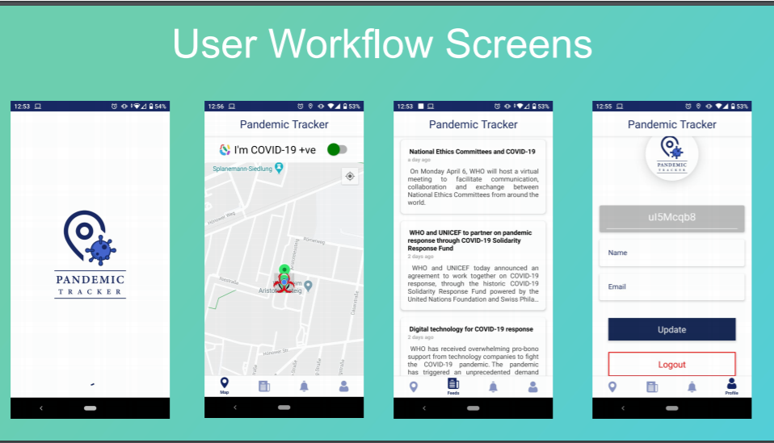

# Pandemic Tracker
Why did we develop this application?

Kindly take 2 minutes of your time to watch the demo video where we explained why did we develop this application.

# Video Link: " https://youtu.be/RbR7SC-k07o "

### Indroduction
In the face of rapidly rising numbers of infected Covid-19 cases globally and the various mitigation approaches adoption by different countries, timely/early detection is the key and technology can be an efficient and scalable tool to arm the common people, the authorities, health professional and the government in establishing a way to enable ‘contact tracing’ which today is a tedious manual process and requires a huge amount of time and investment with inherent delays preventing the tracking of possible infected cases from day zero. 
The proposed ‘Pandemic Tracker’ will help in easy ‘contact tracing’ to identify a possibly infected person from Day Zero and also provide a common user and authorities app notifications of such contact in the last 14 days, instead of waiting for symptomatic alerts which appear only after 4-5 days of infection.  It will provide real time, automated notifications and reports to an individual user based on his/her contact network as well as real time, aggregated reports to the authorities.

# PROBLEM
The challenge for Indian and Karnataka Government is, tracking the people who came in contact with COVID-19 positive person in past 14 days.

# SOLUTION
An application called 'Pandemic Tracker' is developed. The Goal is to track the people who were in contact with the COVID-19 positive tested person in the past 14 days.

# WORK-FLOW
  1.	User Downloads the Application.
  2.	A unique identification number is tagged to the user.
  3.	Registers with his mobile number. (We want to avoid this going forward)
  4.	Login.
  5.	Turn-on GPS Location.
  6.	Redirect to the Landing page.
  7.	Our application scans his surrounding to check if the user is surrounded by any COVID-19 person.
  8.	Minute the user login into our application, we start continuously track his location.
  9.	When the user updates the COVID-19 status to positive, in the backend we fetch the users who were at 2 meters distance from him in the last 14 days with respect to the time and travel history. 
  10.	A notification (via call & text message) will be sent to all the users who were at 2-meter distance. 
  11.	The same report will be sent to concerned government authority.
  12.	The Web application is being developed by the team, only for government officials to keep track of the COVID-19 positive people and all the possible victims in real-time.
      a.	The officials can filter the data according to State/ City/ Postal Code. (This is under development)

# UI Designs.

# ADVANTAGES
The application is beneficial to both government and public. 
  1.	It adds value to the government in the following areas:
    a.	To do root cause analysis of the person might have got contagious. 
      i.	Example: After a week a particular street is marked danger zone, we can figure out who were the people who were exposed in that particular area in the past N number of days. 
      ii.	The web application will be provided to the responsible government officials to pull the results of the facts mentioned in the above point. 
    b.	Trace out all the possible victims (users who might have come in contact with COVID19 +ve person in past 14 days) immediately. Concerned authorities get all the victim’s mobile numbers. This Information is not reviled to the user.
    c.	Track the real-time movements of the COVID-19 positive person and Victim. 
    d.	Age of the users who were most affected.
    e.	If the user was suffering from any chronic diseases before.
    f.	What was the primary symptoms the user started showing.
    g.	All the possible ad-hoc analysis on the data we collect. Helps us to make quick data driven decisions.
  2.	It adds value to the Public in the following areas:
    a.	Get the latest updates from the Governments, This helps the user listen only true facts. 
    b.	Check if the area user is travelling is safe or not or How safe it is?
    c.	Get real-time notifications if the user has crossed the paths with COVID-19 person.
    d.	Check how many COVID-19 victims the user is surrounded with at his current location.

# CAVEATS
There are few limitations of the application we have developed. Few of them can be achieved with the help of Government and few are really very tough to overcome.
  •	It is responsibility of the user to be very careful before user updates the COVID-19 Status to positive.
  •	Difficult to find the location history of the people who are already COVID-19 positive.
  •	Zero network coverage area 
  •	Human errors
  •	GPS switched off 
  •	Switched off Phone
  •	Movement without phones
  •	USER Acceptance to install the application
  •	No update or False Update. This might be a serious threat. (We have the work around for it but requires a bit of extra efforts.) (Strongly educate the people on it)
  •	Inability to track from Contact Surfaces (e.g. live virus on a metal surface)

# FUTURE SCOPE
We are planning to add the additional functionalities to the application but as we are only 3 in a team it is really tough for us to achieve at this moment. If provided with some funds (Only for the application development, not for our efforts) and time we are confident that we can achieve it. 
  •	Keep track of victim’s health on a daily basis.
  •	Integrated the COVID-19 hospitals/test centers with our App. (Can be done now as well by providing the redirects to these websites)
  •	If Govt provides the data of the all the COVID-19 positive people and Quarantined people, then it will be shown on the map.
  •	An alert to be sent if the user is surrounded by COVID-19 positive person within 500 meters range.
  •	Measure the body temperature of the user if the user device has heat sensors and allow user to synchronize, he/she’s smart watch with the application.

# USER RETENTATION
To keep the user engaged with the application we will keep pushing him the local notifications (sent from the Client Side), Latest news and updates from the government and Global notifications (sent from the Server Side).

# What we need from you?
•	Kindly share this with your friend and family who might be interested to contribute for the welfare of the society.
•	We are highly motivated to share our codebase with the community and request you to improve in any way possible.
•	Develop a calling facility within the application. Ex: if we detect any person was in contact with COVID-19 positive person in past 14days, we would like to alert him by providing in app calling facility. By this we can achieve the highest security level, by not collecting any information (phone number, email id) from the user.

# Application Working live Demo
  Here is the video of how the app functions. Real time demo of the application.
# Video Link: "https://youtu.be/k4Y7OJoEiTk"

This is implemented through react-native. The Android build is ready and IoS build will be ready soon. 

 

